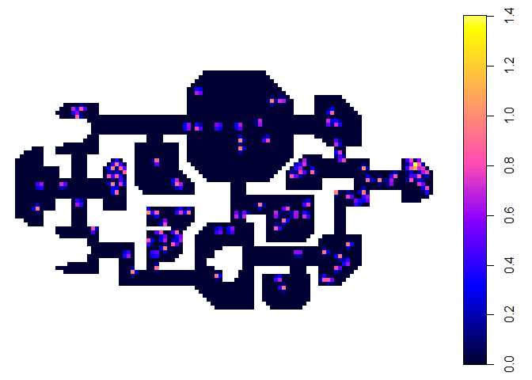
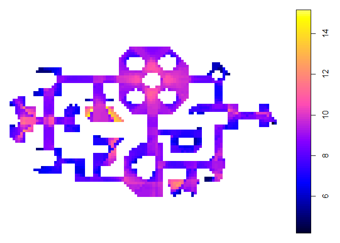

Among Us VGA
================

Clear

``` r
rm(list = ls())
```

# Process VGA Files

Reading MIF Line Files

``` r
map_w_furniture = readOGR("Maps_Analysis/1_With_Furniture.mif", verbose = FALSE)
map_wo_furniture = readOGR("Maps_Analysis/2_Without_Furniture.mif", verbose = FALSE)
```

    ## Warning in readOGR("Maps_Analysis/2_Without_Furniture.mif", verbose = FALSE):
    ## Dropping null geometries: 4, 5, 6, 7, 8, 26, 27, 28, 29, 30, 31, 32, 33, 34, 35,
    ## 48, 49, 50, 51, 170, 174, 175, 176, 177, 178, 179, 180, 181, 182, 183, 184, 185,
    ## 186, 187, 188, 189, 190, 191, 192, 193, 194, 195, 196, 197, 200, 201, 202

``` r
#map_ac = readOGR("Maps_Analysis/3_ac.dxf", verbose = FALSE)
#plot(map_w_furniture)
#plot(map_wo_furniture)
#plot(map_ac)
```

Make Grid on Depthmap and Conduct Basic VGA Processes

``` r
#Map1
rdepthmap::importLines(map_w_furniture, "Maps_Analysis/1_With_Furniture.graph")
rdepthmap::createGrid("Maps_Analysis/1_With_Furniture.graph", gridSize = 700)
rdepthmap::fillGrid("Maps_Analysis/1_With_Furniture.graph", fillX = -39506, fillY = -9412)
rdepthmap::makeVGAGraph("Maps_Analysis/1_With_Furniture.graph")
gallery_w_furniture = rdepthmap::getPointmapData("Maps_Analysis/1_With_Furniture.graph")$map
#names(gallery_w_furniture)

#Map2
rdepthmap::importLines(map_wo_furniture, "Maps_Analysis/2_Without_Furniture.graph")
rdepthmap::createGrid("Maps_Analysis/2_Without_Furniture.graph", gridSize = 700)
rdepthmap::fillGrid("Maps_Analysis/2_Without_Furniture.graph", fillX = -39506, fillY = -9412)
rdepthmap::makeVGAGraph("Maps_Analysis/2_Without_Furniture.graph")
gallery_wo_furniture = rdepthmap::getPointmapData("Maps_Analysis/2_Without_Furniture.graph")$map
#names(gallery_wo_furniture)

#Map3
#rdepthmap::importLines(map_ac, "Maps_Analysis/3_Accessibility.graph")
#rdepthmap::createGrid("Maps_Analysis/3_Accessibility.graph", gridSize = 700)
#rdepthmap::fillGrid("Maps_Analysis/3_Accessibility.graph", fillX = -53601, fillY = -9458)
#rdepthmap::makeVGAGraph("Maps_Analysis/3_Accessibility.graph")
gallery_ac = rdepthmap::getPointmapData("Maps_Analysis/3_Accessibility.graph")$map
#names(gallery_ac)
```

Test Plot

``` r
plot(gallery_w_furniture[, "Point.First.Moment"])
```

<!-- -->

``` r
plot(gallery_wo_furniture[, "Point.First.Moment"])
```

<!-- -->

``` r
plot(gallery_ac[, "Point.First.Moment"])
```

<!-- --> 1)
Process VGA Analysis : map with furniture

``` r
rdepthmap::VGA("Maps_Analysis/1_With_Furniture.graph", vgaMode = "visibility-local", radii = c("2,3,4,5,6,7"))
rdepthmap::VGA("Maps_Analysis/1_With_Furniture.graph", vgaMode = "visibility-global", radii = c("2"))
rdepthmap::VGA("Maps_Analysis/1_With_Furniture.graph", vgaMode = "visibility-global", radii = c("3"))
rdepthmap::VGA("Maps_Analysis/1_With_Furniture.graph", vgaMode = "visibility-global", radii = c("4"))
rdepthmap::VGA("Maps_Analysis/1_With_Furniture.graph", vgaMode = "visibility-global", radii = c("5"))
rdepthmap::VGA("Maps_Analysis/1_With_Furniture.graph", vgaMode = "visibility-global", radii = c("6"))
rdepthmap::VGA("Maps_Analysis/1_With_Furniture.graph", vgaMode = "visibility-global", radii = c("7"))
gallery_w_furniture = rdepthmap::getPointmapData("Maps_Analysis/1_With_Furniture.graph")$map
#names(gallery_w_furniture)
```

2)  Process VGA Analysis : map without furniture

<!-- end list -->

``` r
rdepthmap::VGA("Maps_Analysis/2_Without_Furniture.graph", vgaMode = "visibility-local", radii = c("2,3,4,5,6,7"))
rdepthmap::VGA("Maps_Analysis/2_Without_Furniture.graph", vgaMode = "visibility-global", radii = c("2"))
rdepthmap::VGA("Maps_Analysis/2_Without_Furniture.graph", vgaMode = "visibility-global", radii = c("3"))
rdepthmap::VGA("Maps_Analysis/2_Without_Furniture.graph", vgaMode = "visibility-global", radii = c("4"))
rdepthmap::VGA("Maps_Analysis/2_Without_Furniture.graph", vgaMode = "visibility-global", radii = c("5"))
rdepthmap::VGA("Maps_Analysis/2_Without_Furniture.graph", vgaMode = "visibility-global", radii = c("6"))
rdepthmap::VGA("Maps_Analysis/2_Without_Furniture.graph", vgaMode = "visibility-global", radii = c("7"))
gallery_wo_furniture = rdepthmap::getPointmapData("Maps_Analysis/2_Without_Furniture.graph")$map
#names(gallery_wo_furniture)
```

3)  Process VGA Analysis : map for accessibility

<!-- end list -->

``` r
rdepthmap::VGA("Maps_Analysis/3_Accessibility.graph", vgaMode = "visibility-local", radii = c("2,3,4,5,6,7"))
rdepthmap::VGA("Maps_Analysis/3_Accessibility.graph", vgaMode = "visibility-global", radii = c("2"))
rdepthmap::VGA("Maps_Analysis/3_Accessibility.graph", vgaMode = "visibility-global", radii = c("3"))
rdepthmap::VGA("Maps_Analysis/3_Accessibility.graph", vgaMode = "visibility-global", radii = c("4"))
rdepthmap::VGA("Maps_Analysis/3_Accessibility.graph", vgaMode = "visibility-global", radii = c("5"))
rdepthmap::VGA("Maps_Analysis/3_Accessibility.graph", vgaMode = "visibility-global", radii = c("6"))
rdepthmap::VGA("Maps_Analysis/3_Accessibility.graph", vgaMode = "visibility-global", radii = c("7"))
gallery_ac = rdepthmap::getPointmapData("Maps_Analysis/3_Accessibility.graph")$map
#names(gallery_wo_furniture)
```

List of metrics

``` r
names(gallery_w_furniture)
```

    ##  [1] "Ref"                             "Connectivity"                   
    ##  [3] "Point.First.Moment"              "Point.Second.Moment"            
    ##  [5] "Visual.Entropy.R2"               "Visual.Entropy.R3"              
    ##  [7] "Visual.Entropy.R4"               "Visual.Entropy.R5"              
    ##  [9] "Visual.Entropy.R6"               "Visual.Entropy.R7"              
    ## [11] "Visual.Integration..HH..R2"      "Visual.Integration..HH..R3"     
    ## [13] "Visual.Integration..HH..R4"      "Visual.Integration..HH..R5"     
    ## [15] "Visual.Integration..HH..R6"      "Visual.Integration..HH..R7"     
    ## [17] "Visual.Integration..P.value..R2" "Visual.Integration..P.value..R3"
    ## [19] "Visual.Integration..P.value..R4" "Visual.Integration..P.value..R5"
    ## [21] "Visual.Integration..P.value..R6" "Visual.Integration..P.value..R7"
    ## [23] "Visual.Integration..Tekl..R2"    "Visual.Integration..Tekl..R3"   
    ## [25] "Visual.Integration..Tekl..R4"    "Visual.Integration..Tekl..R5"   
    ## [27] "Visual.Integration..Tekl..R6"    "Visual.Integration..Tekl..R7"   
    ## [29] "Visual.Mean.Depth.R2"            "Visual.Mean.Depth.R3"           
    ## [31] "Visual.Mean.Depth.R4"            "Visual.Mean.Depth.R5"           
    ## [33] "Visual.Mean.Depth.R6"            "Visual.Mean.Depth.R7"           
    ## [35] "Visual.Node.Count.R2"            "Visual.Node.Count.R3"           
    ## [37] "Visual.Node.Count.R4"            "Visual.Node.Count.R5"           
    ## [39] "Visual.Node.Count.R6"            "Visual.Node.Count.R7"           
    ## [41] "Visual.Relativised.Entropy.R2"   "Visual.Relativised.Entropy.R3"  
    ## [43] "Visual.Relativised.Entropy.R4"   "Visual.Relativised.Entropy.R5"  
    ## [45] "Visual.Relativised.Entropy.R6"   "Visual.Relativised.Entropy.R7"  
    ## [47] "i"                               "j"

# Load Danger Maps Data

### Visualize Ethnography (Danger Map)

``` r
eth.grid = as(eth,"SpatialPixelsDataFrame")
plot(eth.grid[, "Verified8k"])
```

<!-- -->

``` r
plot(eth.grid[, "Verified9k"])
```

<!-- -->

### Process Reddit Post with 8k Likes

``` r
v_8k_df = data.frame(values)
v_8k_df$risk = eth$Verified8k
#write_csv(v_8k_df,"ouputdata/Verification8k.csv")

rsq_8k_df = purrr::map(v_8k_df[,-1],  ~lm(risk ~ .x, data = v_8k_df)) %>%
  purrr::map(broom::glance) %>%
  dplyr::bind_rows(.id = "variable") %>%
  dplyr::select(variable, r.squared)
#rsq_8k_df

f_rsq_8k_df  = rsq_8k_df %>% 
  .[-c(46, 47, 48, 49,50), ] %>% 
  arrange(desc(r.squared))
```

### Process Reddit Post with 9k Likes

``` r
v_9k_df = data.frame(values)
v_9k_df$risk = eth$Verified9k
#write_csv(v_9k_df,"ouputdata/Verification9k.csv")

rsq_9k_df = purrr::map(v_9k_df[,-1],  ~lm(risk ~ .x, data = v_9k_df)) %>%
  purrr::map(broom::glance) %>%
  dplyr::bind_rows(.id = "variable") %>%
  dplyr::select(variable, r.squared)
#rsq_9k_df

f_rsq_9k_df  = rsq_9k_df %>% 
  .[-c(46, 47, 48, 49,50), ] %>% 
  arrange(desc(r.squared))
```

## Compare R.Squared Values

``` r
p_8k <- ggplot(data=f_rsq_8k_df, aes(x=variable, y=r.squared)) +
  geom_bar(stat="identity")
p_8k + theme(axis.text.x = element_text(angle = 90, vjust = 0.5, hjust=1))
```

<!-- -->

``` r
p_9k <- ggplot(data=f_rsq_9k_df, aes(x=variable, y=r.squared)) +
  geom_bar(stat="identity")
p_9k + theme(axis.text.x = element_text(angle = 90, vjust = 0.5, hjust=1))
```

<!-- --> \#\#
Scatter different Visual Metrics

``` r
#ggplot(v_8k_df, aes(x=v_8k_df$risk, y=v_8k_df$Visual.Node.Count.R3)) + geom_point()
ggplot(v_8k_df, aes(x=v_8k_df$risk, y=v_8k_df$Visual.Relativised.Entropy.R6)) + geom_point(shape=1,size=5) 
```

<!-- --> \#\#
Visualize Actual on Map

``` r
#plot(gallery_w_furniture[, "Visual.Node.Count.R3"])
plot(gallery_w_furniture[, "Visual.Relativised.Entropy.R6"])
```

<!-- -->

``` r
plot(gallery_w_furniture[, "Visual.Integration..P.value..R7"])
```

<!-- -->

``` r
eth.grid = as(eth,"SpatialPixelsDataFrame")
plot(eth.grid[, "Verified8k"])
```

<!-- -->

``` r
plot(eth.grid[, "Verified9k"])
```

<!-- -->

# Load Kill Map Data

## Find Point Deaths

``` r
#Visualize Points
pd = readOGR("Maps_Ethnography/Deaths.mif")
```

    ## OGR data source with driver: MapInfo File 
    ## Source: "D:\Google Drive 0\GitHub\AmongUsVGA\Maps_Ethnography\Deaths.mif", layer: "Deaths"
    ## with 102 features
    ## It has 1 fields

``` r
plot(gallery_w_furniture[, "Visual.Integration..Tekl..R7"])
plot(pd, add = TRUE, col = "red")
```

<!-- --> Kernel
Density Graph at 2500 RADIUS

``` r
ma = as(eth.grid[, "Verified8k"],"owin")
pp = as(pd,"ppp")
marks(pp) = NULL
Window(pp) = ma
K <- density(pp,sigma = 3000)  #more is more spread
plot(K, main=NULL, las=1)
contour(K, add=TRUE)
```

<!-- -->
Convert Kernel Density Graph into SPDF to Visualize

``` r
d = eth
d1 = cbind(d,K)
d1$x <- NULL
d1$y <- NULL
d1$optional <- NULL
d.grid = as(d1,"SpatialPixelsDataFrame")
plot(d.grid[, "value"])

pd = readOGR("Maps_Ethnography/Deaths.mif")
```

    ## OGR data source with driver: MapInfo File 
    ## Source: "D:\Google Drive 0\GitHub\AmongUsVGA\Maps_Ethnography\Deaths.mif", layer: "Deaths"
    ## with 102 features
    ## It has 1 fields

``` r
plot(pd, add = TRUE, col = "red")
```

<!-- -->
Testing R Correlation

``` r
v_0k_df = data.frame(values)
v_0k_df$risk = d1$value

rsq_0k_df = purrr::map(v_0k_df[,-1],  ~lm(risk ~ .x, data = v_0k_df)) %>%
  purrr::map(broom::glance) %>%
  dplyr::bind_rows(.id = "variable") %>%
  dplyr::select(variable, r.squared)
```

    ## Warning in summary.lm(x): essentially perfect fit: summary may be unreliable
    
    ## Warning in summary.lm(x): essentially perfect fit: summary may be unreliable

``` r
#rsq_0k_df

f_rsq_0k_df  = rsq_0k_df %>% 
  .[-c(46, 47, 48, 49,50), ] %>% 
  arrange(desc(r.squared))


p_0k <- ggplot(data=f_rsq_0k_df, aes(x=variable, y=r.squared)) +
  geom_bar(stat="identity")
p_0k + theme(axis.text.x = element_text(angle = 90, vjust = 0.5, hjust=1))
```

<!-- -->

## Using QGIS manipulated map

``` r
#Visualize Heatmap Diagram
death = readOGR("Maps_Ethnography/Ethnography_2.mif")
```

    ## OGR data source with driver: MapInfo File 
    ## Source: "D:\Google Drive 0\GitHub\AmongUsVGA\Maps_Ethnography\Ethnography_2.mif", layer: "Ethnography_2"
    ## with 2998 features
    ## It has 7 fields

``` r
death.grid = as(death,"SpatialPixelsDataFrame")
plot(death.grid[, "one"])
```

<!-- -->

``` r
plot(death.grid[, "onehalf"])
```

<!-- -->

``` r
plot(death.grid[, "two"])
```

<!-- -->

``` r
plot(death.grid[, "twohalf"])
```

<!-- --> Check
Distribution of Values (TOTAL 3000 points)

Correlation Test

## Correlation Based on Heatmap

``` r
p_1k <- ggplot(data=f_rsq_1k_df, aes(x=variable, y=r.squared)) +
  geom_bar(stat="identity")
p_1k + theme(axis.text.x = element_text(angle = 90, vjust = 0.5, hjust=1))
```

<!-- -->

``` r
p_1_5k <- ggplot(data=f_rsq_1_5k_df, aes(x=variable, y=r.squared)) +
  geom_bar(stat="identity")
p_1_5k + theme(axis.text.x = element_text(angle = 90, vjust = 0.5, hjust=1))
```

<!-- -->

``` r
p_2k <- ggplot(data=f_rsq_2k_df, aes(x=variable, y=r.squared)) +
  geom_bar(stat="identity")
p_2k + theme(axis.text.x = element_text(angle = 90, vjust = 0.5, hjust=1))
```

<!-- -->

``` r
p_2_5k <- ggplot(data=f_rsq_2_5k_df, aes(x=variable, y=r.squared)) +
  geom_bar(stat="identity")
p_2_5k + theme(axis.text.x = element_text(angle = 90, vjust = 0.5, hjust=1))
```

<!-- -->

## Distribution of Data Points based on Visual Metrics

``` r
overlapsPD = over(pd,gallery_w_furniture)
overlapsPD.a <- scale(overlapsPD[,2:46],center=T,scale=T)
overlapsPD.b = as.data.frame(overlapsPD.a)
overlapsPD.b$Ref =overlapsPD$Ref
DAT.melt = melt(overlapsPD.b,id=c("Ref"))
ggplot(DAT.melt, aes(x=variable,y=value) ) + geom_point(shape=1,size=4)  + theme(axis.text.x = element_text(angle = 90, vjust = 0.5, hjust=1))
```

    ## Warning: Removed 102 rows containing missing values (geom_point).

<!-- -->

# General Map Visibility

## Compare visibility radius 2-7

### 1\. map with furniture

``` r
plot(gallery_w_furniture[, "Visual.Integration..HH..R2"])
```

<!-- -->

``` r
plot(gallery_w_furniture[, "Visual.Integration..HH..R3"])
```

<!-- -->

``` r
plot(gallery_w_furniture[, "Visual.Integration..HH..R7"])
```

<!-- --> \#\#\#
2. map without furniture

``` r
plot(gallery_wo_furniture[, "Visual.Integration..HH..R2"])
```

<!-- -->

``` r
plot(gallery_wo_furniture[, "Visual.Integration..HH..R3"])
```

<!-- -->

``` r
plot(gallery_wo_furniture[, "Visual.Integration..HH..R7"])
```

<!-- --> \#\#\#
3. map accessibility

``` r
plot(gallery_ac[, "Visual.Integration..HH..R2"])
```

<!-- -->

``` r
plot(gallery_ac[, "Visual.Integration..HH..R3"])
```

<!-- -->

``` r
plot(gallery_ac[, "Visual.Integration..HH..R7"])
```

<!-- -->

### Compare with and without furniture

#### Visual Integration R7

``` r
plot(gallery_w_furniture[, "Visual.Integration..HH..R7"])
```

<!-- -->

``` r
plot(gallery_wo_furniture[, "Visual.Integration..HH..R7"])
```

<!-- -->
\#\#\#\# Visual Entropy, R6

``` r
plot(gallery_w_furniture[, "Visual.Relativised.Entropy.R6"])
```

<!-- -->

``` r
plot(gallery_wo_furniture[, "Visual.Relativised.Entropy.R6"])
```

<!-- -->

# Feature Visibility

## Visualizing Feature Spaces

``` r
#names(gallery_w_furniture)

feature_layer = readOGR("Maps_Analysis/Feature_Polygon2.mif", verbose = FALSE)
plot(gallery_w_furniture[, "Visual.Integration..HH..R7"])
plot(feature_layer, add = TRUE, col = "red")
```

<!-- --> \#\#
Complete Feature List

``` r
overlapsDF = over(gallery_w_furniture[, "Visual.Integration..HH..R7"], feature_layer)
visi_df = aggregate(gallery_w_furniture$Visual.Integration..HH..R7, by = list(overlapsDF$Layer,overlapsDF$Text,overlapsDF$LengthTask,overlapsDF$VisualTask), mean, areaWeighted = TRUE)
vif = visi_df %>% arrange(Group.4)
write.csv(vif,"ouputdata/visualintegration_features.csv")
```

## Comparisons by Averaging

@Types\_of\_Task

``` r
visi_df %>%
            group_by(Group.1) %>%
            summarise(V_r7 = mean(x))
```

    ## # A tibble: 5 x 2
    ##   Group.1       V_r7
    ##   <chr>        <dbl>
    ## 1 emergency     8.52
    ## 2 sabotage      3.14
    ## 3 surveillance  3.43
    ## 4 tasks         3.87
    ## 5 vents         3.79

@Length\_of\_Task

``` r
visi_df %>%
          filter(Group.1 == "tasks" | Group.1 == "hotpink" | Group.1 == "lightpink") %>%
            group_by(Group.3) %>%
            summarise(V_r7 = mean(x))
```

    ## # A tibble: 3 x 2
    ##   Group.3  V_r7
    ##   <chr>   <dbl>
    ## 1 Common   4.00
    ## 2 Long     4.34
    ## 3 Short    3.61

@Visual\_Type\_of\_Task

``` r
visi_df %>%
          filter(Group.1 == "tasks" | Group.1 == "hotpink" | Group.1 == "lightpink") %>% 
            group_by(Group.4) %>%
            summarise(V_r7 = mean(x))
```

    ## # A tibble: 2 x 2
    ##   Group.4   V_r7
    ##   <chr>    <dbl>
    ## 1 ""        3.66
    ## 2 "Visual"  4.96

Plot of Visibility for Each Tasks

``` r
task_all_df = visi_df %>% filter(Group.1 == "tasks") %>% .[c(3,5)] 
task_time_df = visi_df %>% filter(Group.1 == "tasks") %>% .[c(3,5)]
task_visual_df = visi_df %>% filter(Group.1 == "tasks") %>% .[c(4,5)]

task_all_df$Group.3 = "All"
taskall = melt(task_all_df,id=c("Group.3"))
tasklength = melt(task_time_df,id=c("Group.3"))
taskvisual = melt(task_visual_df,id=c("Group.4")) %>% filter(Group.4 == 'Visual')
names(taskvisual)[1] <- "Group.3"

task_df = rbind(taskall,tasklength,taskvisual)
ggplot(task_df, aes(x=Group.3,y=value, color = Group.3) ) + geom_boxplot(shape=2,size=1)  + theme(axis.text.x = element_text(angle = 0, vjust = 0.5, hjust=0.5)) + labs(x="")
```

<!-- -->

## Feature Tables

@Types\_of\_Task

``` r
visi_df %>% filter(Group.1 == "tasks")
```

    ##    Group.1                          Group.2 Group.3 Group.4        x
    ## 1    tasks                   Fix Wiring [1]  Common         3.714819
    ## 2    tasks                   Fix Wiring [2]  Common         5.800073
    ## 3    tasks                   Fix Wiring [3]  Common         4.576949
    ## 4    tasks                   Fix Wiring [4]  Common         3.415989
    ## 5    tasks                   Fix Wiring [5]  Common         2.404976
    ## 6    tasks                       Swipe Card  Common         4.111414
    ## 7    tasks        Fuel Engines Part 1 and 3    Long         3.863964
    ## 8    tasks              Fuel Engines Part 2    Long         3.126319
    ## 9    tasks              Fuel Engines Part 4    Long         2.767753
    ## 10   tasks                   Inspect Sample    Long         3.915823
    ## 11   tasks                    Start Reactor    Long         3.232568
    ## 12   tasks Accept Diverted Power Part 2 [1]   Short         2.656431
    ## 13   tasks Accept Diverted Power Part 2 [2]   Short         3.231415
    ## 14   tasks Accept Diverted Power Part 2 [3]   Short         4.173330
    ## 15   tasks Accept Diverted Power Part 2 [4]   Short         3.218441
    ## 16   tasks Accept Diverted Power Part 2 [5]   Short         3.028439
    ## 17   tasks Accept Diverted Power Part 2 [6]   Short         4.205980
    ## 18   tasks Accept Diverted Power Part 2 [7]   Short         6.372041
    ## 19   tasks Accept Diverted Power Part 2 [8]   Short         3.641347
    ## 20   tasks    Align Engine Output (1/2) [1]   Short         3.068366
    ## 21   tasks    Align Engine Output (1/2) [2]   Short         2.770892
    ## 22   tasks           Callibrate Distributor   Short         3.236655
    ## 23   tasks                     Chart Course   Short         3.568187
    ## 24   tasks                  Clean O2 Filter   Short         3.640360
    ## 25   tasks              Divert Power Part 1   Short         2.401324
    ## 26   tasks             Download Data Part 2   Short         4.328570
    ## 27   tasks               Stabilize Steering   Short         3.676948
    ## 28   tasks                 Unlock Manifolds   Short         3.198719
    ## 29   tasks           Upload Data Part 1 [1]   Short         2.925612
    ## 30   tasks           Upload Data Part 1 [2]   Short         3.121275
    ## 31   tasks           Upload Data Part 1 [3]   Short         6.170896
    ## 32   tasks                  Clear Asteroids    Long  Visual 6.468803
    ## 33   tasks               Empty Chute Part 1    Long  Visual 3.638143
    ## 34   tasks             Empty Garbage Part 1    Long  Visual 6.372089
    ## 35   tasks       Empty Garbage/Chute Part 2    Long  Visual 6.069834
    ## 36   tasks                      Submit Scan    Long  Visual 3.934792
    ## 37   tasks                    Prime Shields   Short  Visual 3.251733

``` r
visi_df %>% filter(Group.1 == "sabotage")
```

    ##    Group.1                 Group.2 Group.3 Group.4        x
    ## 1 sabotage Communications Disabled                 3.076162
    ## 2 sabotage              Fix Lights                 3.219213
    ## 3 sabotage    Oxygen Depletion [1]                 3.646781
    ## 4 sabotage    Oxygen Depletion [2]                 4.098094
    ## 5 sabotage    Reactor Meltdown [1]                 2.411017
    ## 6 sabotage    Reactor Meltdown [2]                 2.411449

``` r
visi_df %>% filter(Group.1 == "surveillance")
```

    ##        Group.1         Group.2 Group.3 Group.4        x
    ## 1 surveillance       Admin Map                 4.142141
    ## 2 surveillance Security Camera                 2.707994

``` r
visi_df %>% filter(Group.1 == "vents")
```

    ##    Group.1              Group.2 Group.3 Group.4        x
    ## 1    vents           vent@admin                 3.088639
    ## 2    vents       vent@cafeteria                 6.507001
    ## 3    vents      vent@electrical                 2.399609
    ## 4    vents         vent@hallway                 3.873818
    ## 5    vents     vent@lowerengine                 3.365943
    ## 6    vents vent@navigations [1]                 2.661428
    ## 7    vents vent@navigations [2]                 2.658795
    ## 8    vents     vent@reactor [1]                 3.206355
    ## 9    vents     vent@reactor [2]                 3.195865
    ## 10   vents    vent@security [1]                 3.969348
    ## 11   vents    vent@security [2]                 3.155351
    ## 12   vents         vent@shields                 3.274905
    ## 13   vents     vent@upperengine                 4.285781
    ## 14   vents     vent@weapons [1]                 5.120081
    ## 15   vents     vent@weapons [2]                 6.062708

@Length\_of\_Task

``` r
visi_df %>% filter(Group.3 == "Long") %>% select(-one_of(c("Group.1","Group.2")))
```

    ##    Group.3 Group.4        x
    ## 1     Long         3.863964
    ## 2     Long         3.126319
    ## 3     Long         2.767753
    ## 4     Long         3.915823
    ## 5     Long         3.232568
    ## 6     Long  Visual 6.468803
    ## 7     Long  Visual 3.638143
    ## 8     Long  Visual 6.372089
    ## 9     Long  Visual 6.069834
    ## 10    Long  Visual 3.934792

``` r
visi_df %>% filter(Group.3 == "Common") %>% select(-one_of(c("Group.1","Group.2")))
```

    ##   Group.3 Group.4        x
    ## 1  Common         3.714819
    ## 2  Common         5.800073
    ## 3  Common         4.576949
    ## 4  Common         3.415989
    ## 5  Common         2.404976
    ## 6  Common         4.111414

``` r
visi_df %>% filter(Group.3 == "Short") %>% select(-one_of(c("Group.1","Group.2")))
```

    ##    Group.3 Group.4        x
    ## 1    Short         2.656431
    ## 2    Short         3.231415
    ## 3    Short         4.173330
    ## 4    Short         3.218441
    ## 5    Short         3.028439
    ## 6    Short         4.205980
    ## 7    Short         6.372041
    ## 8    Short         3.641347
    ## 9    Short         3.068366
    ## 10   Short         2.770892
    ## 11   Short         3.236655
    ## 12   Short         3.568187
    ## 13   Short         3.640360
    ## 14   Short         2.401324
    ## 15   Short         4.328570
    ## 16   Short         3.676948
    ## 17   Short         3.198719
    ## 18   Short         2.925612
    ## 19   Short         3.121275
    ## 20   Short         6.170896
    ## 21   Short  Visual 3.251733

@Visual\_Type\_of\_Task

``` r
visi_df %>% filter(Group.4 == "Visual") %>% select(-one_of(c("Group.1")))
```

    ##                      Group.2 Group.3 Group.4        x
    ## 1            Clear Asteroids    Long  Visual 6.468803
    ## 2         Empty Chute Part 1    Long  Visual 3.638143
    ## 3       Empty Garbage Part 1    Long  Visual 6.372089
    ## 4 Empty Garbage/Chute Part 2    Long  Visual 6.069834
    ## 5                Submit Scan    Long  Visual 3.934792
    ## 6              Prime Shields   Short  Visual 3.251733

``` r
visi_df %>% filter(Group.1 == "tasks" | Group.1 == "hotpink" | Group.1 == "lightpink") %>% filter(Group.4 != "Visual") %>% select(-one_of(c("Group.1")))
```

    ##                             Group.2 Group.3 Group.4        x
    ## 1                    Fix Wiring [1]  Common         3.714819
    ## 2                    Fix Wiring [2]  Common         5.800073
    ## 3                    Fix Wiring [3]  Common         4.576949
    ## 4                    Fix Wiring [4]  Common         3.415989
    ## 5                    Fix Wiring [5]  Common         2.404976
    ## 6                        Swipe Card  Common         4.111414
    ## 7         Fuel Engines Part 1 and 3    Long         3.863964
    ## 8               Fuel Engines Part 2    Long         3.126319
    ## 9               Fuel Engines Part 4    Long         2.767753
    ## 10                   Inspect Sample    Long         3.915823
    ## 11                    Start Reactor    Long         3.232568
    ## 12 Accept Diverted Power Part 2 [1]   Short         2.656431
    ## 13 Accept Diverted Power Part 2 [2]   Short         3.231415
    ## 14 Accept Diverted Power Part 2 [3]   Short         4.173330
    ## 15 Accept Diverted Power Part 2 [4]   Short         3.218441
    ## 16 Accept Diverted Power Part 2 [5]   Short         3.028439
    ## 17 Accept Diverted Power Part 2 [6]   Short         4.205980
    ## 18 Accept Diverted Power Part 2 [7]   Short         6.372041
    ## 19 Accept Diverted Power Part 2 [8]   Short         3.641347
    ## 20    Align Engine Output (1/2) [1]   Short         3.068366
    ## 21    Align Engine Output (1/2) [2]   Short         2.770892
    ## 22           Callibrate Distributor   Short         3.236655
    ## 23                     Chart Course   Short         3.568187
    ## 24                  Clean O2 Filter   Short         3.640360
    ## 25              Divert Power Part 1   Short         2.401324
    ## 26             Download Data Part 2   Short         4.328570
    ## 27               Stabilize Steering   Short         3.676948
    ## 28                 Unlock Manifolds   Short         3.198719
    ## 29           Upload Data Part 1 [1]   Short         2.925612
    ## 30           Upload Data Part 1 [2]   Short         3.121275
    ## 31           Upload Data Part 1 [3]   Short         6.170896
